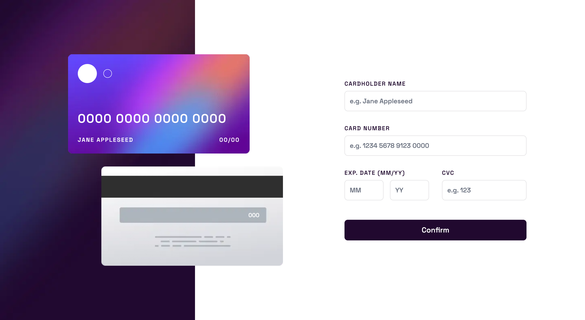

# Frontend Mentor - Interactive card details form solution

This is a solution to the [Interactive card details form challenge on Frontend Mentor](https://www.frontendmentor.io/challenges/interactive-card-details-form-XpS8cKZDWw). Frontend Mentor challenges help you improve your coding skills by building realistic projects. 

## Table of contents

- [Overview](#overview)
  - [The challenge](#the-challenge)
  - [Screenshot](#screenshot)
  - [Links](#links)
- [My process](#my-process)
  - [Built with](#built-with)
  - [What I learned](#what-i-learned)
  - [Continued development](#continued-development)
  - [Useful resources](#useful-resources)
- [Author](#author)

**Note: Delete this note and update the table of contents based on what sections you keep.**

## Overview

### The challenge

Users should be able to:

- Fill in the form and see the card details update in real-time
- Receive error messages when the form is submitted if:
  - Any input field is empty
  - The card number, expiry date, or CVC fields are in the wrong format
- View the optimal layout depending on their device's screen size
- See hover, active, and focus states for interactive elements on the page

### Screenshot



### Links

- Solution URL: [View on Netlify](https://fem-newsletter-signup-seanhillweb.netlify.app/)
- Project URL: [View on Github](https://github.com/seanhillweb/frontend-mentor-interactive-card-details-form)

## My process

### Built with

- [React](https://reactjs.org/)
- [React Hook Forms](https://www.react-hook-form.com/)
- [Next.js](https://nextjs.org/)
- [Tailwind CSS](https://tailwindcss.com/)

### What I learned

How to manage parent and child component state. Originally, I had rendering issues combining the form with the page content. Make unique components, and passing in state as a prop, solved the rendering issue.

```js
const [values, setValues] = useState(creditCardValues);

...

<Form values={values} onChange={setValues}/>
```

### Continued development

For future forms, I would like to try [Yup](https://github.com/jquense/yup) for validation and object schema. React Hook Forms seems to be enough for simple forms.

### Useful resources

- [Updating Arrays in State](https://react.dev/learn/updating-arrays-in-state) - This helped structure the form's inputs onChange events.
  - [How to Handle Multiple Inputs](https://dev.to/deboragaleano/how-to-handle-multiple-inputs-in-react-55el)
- [Credit Card Validation](https://medium.com/hootsuite-engineering/a-comprehensive-guide-to-validating-and-formatting-credit-cards-b9fa63ec7863) - Primarily used for informational purposes. As our form is simple enough to not use all these edge cases.

## Author

- Website - [Sean Hill](https://www.seanhillweb.com)
- Frontend Mentor - [@seanhillweb](https://www.frontendmentor.io/profile/seanhillweb)
